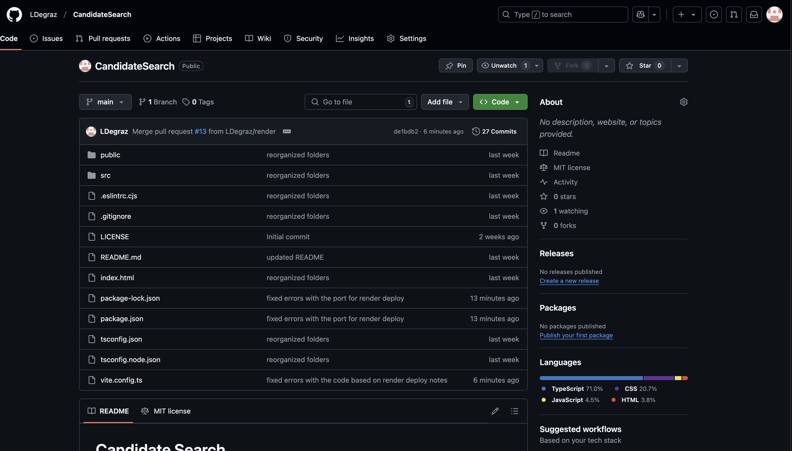
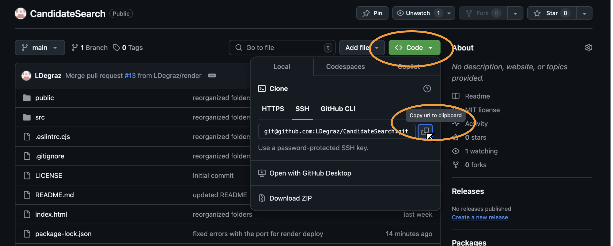
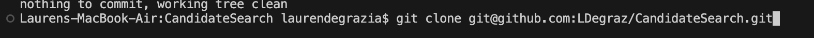
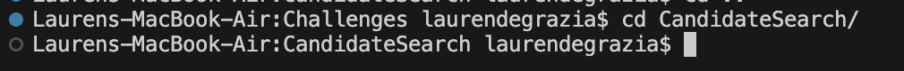
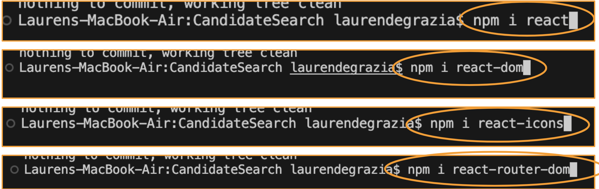
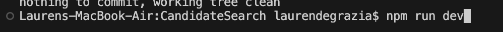
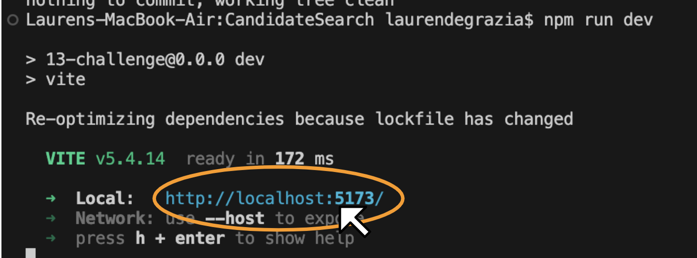
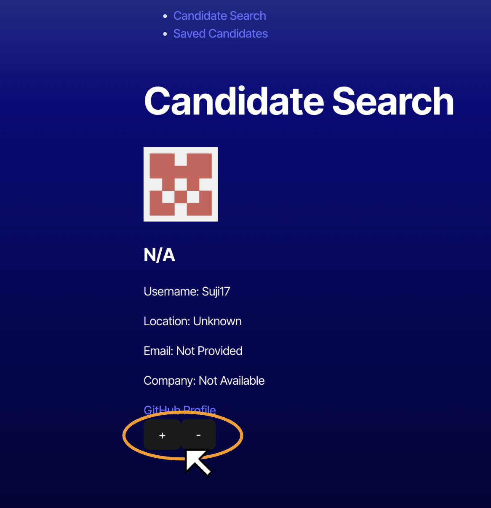
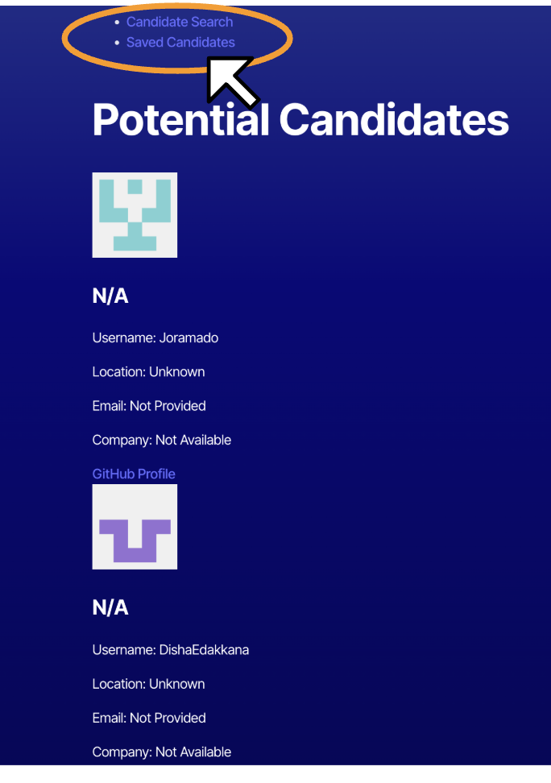

# Candidate Search

## Description
**Thanks for choosing Candidate Search!** 
This application will help employers staff their companies with strong, qualified candidates without messy paperwork cluttering your desk.

## Table of Contents
- [Installation](#installation)
- [Usage](#usage)
- [Contributors](#contributors)
- [License](#license)
- [Questions](#questions)

## Installation
To install this application, please follow the steps below:

1. **Prerequisites:** Please be sure to have the following installed:
- [Node.js](https://nodejs.or/)
- [npm](https://www.npmjs.com/) Node package manager, comes with Node.js

2. **Go to Candidate Search repo:**
- [Click here for Candidate Search Repo](https://github.com/LDegraz/CandidateSearch.git)

   

3. **Copy SSH Key & Clone Repo:**
- Click "code" & copy the SSH key to your clipboard

   

- Go to your local code editor (VS-Code) & paste the SSH key after the command: git clone

   

- Navigate to the project directory using the command: cd CandidateSearch

   

4. **Install Dependencies:**
- **Note: Please be sure you installed the prerequisites in step 1. You will need npm installed for this step**
- Install the required npm packages: react, react-dom, react-icons, & react-router-dom

   

5. **Run the Application:**
- Start the Candidate Search by typing the following command in your terminal: npm run dev

   

- Click the local link to access the application

   

## Usage

### [Click here for the Candidate Search website](https://candidatesearch-9qet.onrender.com)

To use the Candidate Search application, follow these steps:
1. Browse the candidates to clicking “+” or “-” buttons
- click “-” if you are not interested in that candidate & you will be shown the next applicant. 
- click “+” if you would like to save the candidate for future consideration

   

2. Click “saved candidates” to view potential hires 
  
   

## Contributors
- [Lauren DeGrazia](https://github.com/LDegraz/CandidateSearch.git) - Project Creator
- Starter Code - Initial setup & structure
- [node](https://nodejs.org/en) - A JavaScript runtime built on Chrome's V8 JavaScript engine, enabling server-side scripting.
- [npm](https://www.npmjs.com/) - The package manager for JavaScript, used to manage project dependencies.
- [react](https://react.dev/) - A declarative, efficient, and flexible JavaScript library for building user interfaces.
- [react-dom](https://www.npmjs.com/package/react-dom) - The package that provides DOM-specific methods for React, enabling the rendering of React components to the DOM.
- [react-icons](https://react-icons.github.io/react-icons/) - A library that provides popular icon packs as React components, allowing for easy integration of icons in your project.
- [react-router-dom](https://www.npmjs.com/package/react-router-dom) - A collection of navigational components that compose declaratively with your application, allowing for dynamic routing in React applications.
- Xpert Learning Assistant - The AI Learning Assistant for support and guidance throughout the bootcamp.
- Lesley Vaden - T.A., providing guidance and support throughout the assignment.
- Kevin Ferguson: Instructor, providing guidance and support throughout the assignment.

## License
This project is licensed under the MIT license. See below for details.

### MIT License

Copyright (c) [2024] [Lauren DeGrazia]

Permission is hereby granted, free of charge, to any person obtaining a copy
of this software and associated documentation files (the "Software"), to deal
in the Software without restriction, including without limitation the rights
to use, copy, modify, merge, publish, distribute, sublicense, and/or sell
copies of the Software, and to permit persons to whom the Software is
furnished to do so, subject to the following conditions:

The above copyright notice and this permission notice shall be included in all
copies or substantial portions of the Software.

THE SOFTWARE IS PROVIDED "AS IS", WITHOUT WARRANTY OF ANY KIND, EXPRESS OR
IMPLIED, INCLUDING BUT NOT LIMITED TO THE WARRANTIES OF MERCHANTABILITY,
FITNESS FOR A PARTICULAR PURPOSE AND NONINFRINGEMENT. IN NO EVENT SHALL THE
AUTHORS OR COPYRIGHT HOLDERS BE LIABLE FOR ANY CLAIM, DAMAGES OR OTHER
LIABILITY, WHETHER IN AN ACTION OF CONTRACT, TORT OR OTHERWISE, ARISING FROM,
OUT OF OR IN CONNECTION WITH THE SOFTWARE OR THE USE OR OTHER DEALINGS IN THE
SOFTWARE.

## Questions
If you have any questions, feel free to reach out!
- **GitHub:** [LDeGraz](https://github.com/LDegraz)
- **Email:** [degrazial3@gmail.com](mailto:degrazial3@gmail.com)

### How to Contact
You can contact me via email for any inquiries or feedback regarding this project. Alternatively, you can open an issue on GitHub if you encounter any problems or have suggestions for improvements. I will do my best to respond promptly!